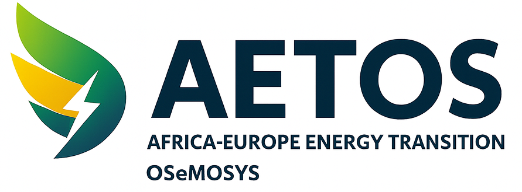
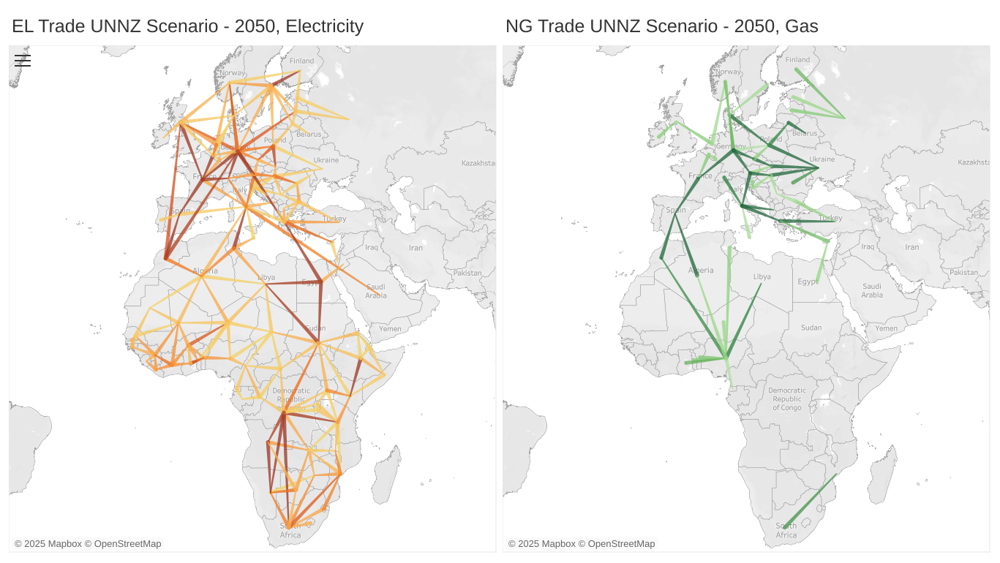

<p align="center">
  
</p>

<h1 align="center">AETOS — Africa–Europe Energy Transition OSeMOSYS</h1>

<p align="center">
  <em>A multi-country open-source energy system model integrating Europe and Africa.</em>
</p>

<p align="center">
  <a href="https://doi.org/10.5281/zenodo.17638228">
    
  </a>
</p>


---

## Overview

The **AETOS** (Africa–Europe Energy Transition OSeMOSYS) model is a large-scale,
multi-country, open-source energy system model developed under the
**RE-INTEGRATE** Horizon Europe project (Grant No. 101118217).

It integrates and extends the **OSeMBE (Europe)** and **TEMBA (Africa)** frameworks,
providing a unified cross-continental representation of:

- national electricity systems
- cross-border interconnectors
- natural gas trade infrastructure
- LNG terminals and pipelines

The model enables scenario analysis supporting economic planning, infrastructure
investments, decarbonization strategy, and energy-security assessment across
**78 countries** (48 in Africa, 30 in Europe).

<p align="center">
  
  <br>
  <em>Figure: UNNZ Scenario Electricity & Gas Trade in 2050.</em>
</p>

---

## Key Features

- **Geographic coverage**: 78 modelled countries across Africa and Europe  
- **Time horizon**: Annual resolution 2021–2055  
- **Energy carriers**: Electricity and natural gas  
- **International trade**: Interconnectors, pipelines, LNG  
- **Units**: GW (capacity), PJ (flows), MtCO₂ (emissions), 2021 USD (costs)  
- **Open data**: Fully transparent assumptions and input files  

---

## Documentation

Full documentation is available on ReadTheDocs:

📘 https://aetos-model.readthedocs.io/en/latest/

> The documentation includes methodology, parameter sources,
> techno-economic assumptions, datasets, trade structure, scenario definitions,
> troubleshooting, and reproducibility instructions.

---

## How to Cite

If you use **AETOS** in academic publications, analyses, reports, or presentations,
please cite the model as follows:

**Short citation (recommended):**

> Kousoulos, E. et al. (2025). *The Africa–Europe Energy Transition OSeMOSYS (AETOS) Model:
> A Multi-Country Framework for Cross-Continental Energy Trade.* Zenodo.  
> https://doi.org/10.5281/zenodo.17638228

**BibTeX:**

```bibtex
@software{AETOS_2025,
  author       = {Kousoulos, Elias and collaborators},
  title        = {The Africa--Europe Energy Transition OSeMOSYS (AETOS) Model:
                   A Multi-Country Framework for Cross-Continental Energy Trade},
  year         = {2025},
  publisher    = {Zenodo},
  doi          = {10.5281/zenodo.17638228},
  url          = {https://doi.org/10.5281/zenodo.17638228},
}
